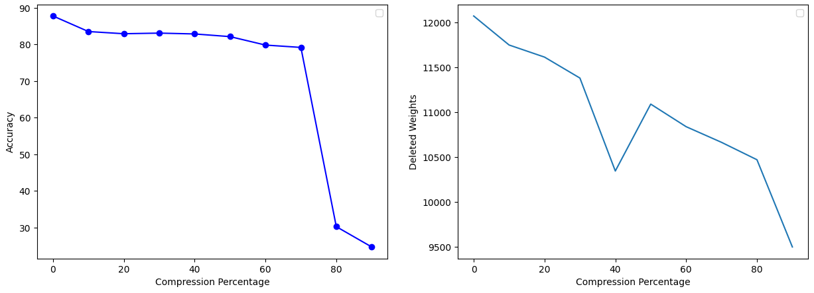

## Description
This repository hosts a Python implementation of my pattern recognition Project, our goal was to perform the method of compressing a model in order to provide an optimal model for a classification based on mlp, so that we can avoid the unnecessary use of larger models. With research and study, the method we chose was the Weight Sharing method

## Requirements
The code is implemented in Python 3.12.10 and has been tested on Windows 10 without encountering any issues. Below are the non-standard libraries and their corresponding versions used in writing the code:
<pre>
matplotlib==3.5.1
numpy==1.22.0
torch==2.0.1+cu118
</pre>

## Usage
The network weights for each each algorithm is stored in Models folder, we implemented the desired Regulization for both mlp and resnet model variation for both synscal and synscaw. we saved weights for both best accuracy and least loss. 

## Showcase
You can view the training procedure through the following Images, demonstrating the learned process across episodes. after that we an review Results of each training.

  

